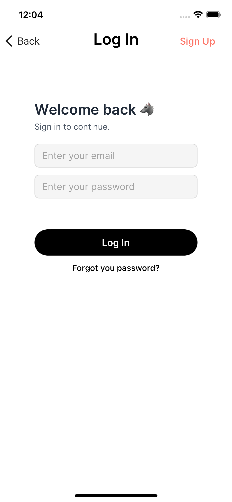
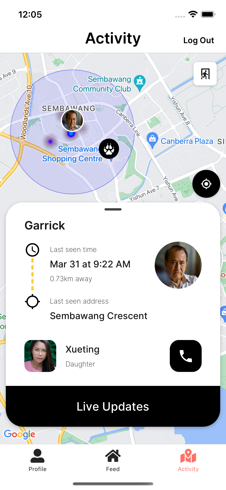
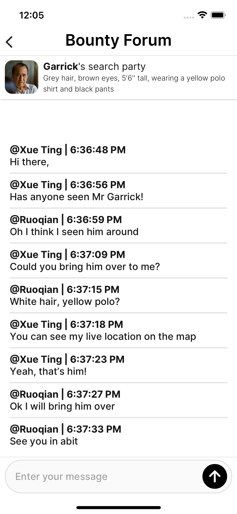

# Hunter

## Introduction

Hunter is an innovative solution for finding lost elderly, children, and pets using the power of technology and the gig economy. Our app aims to contribute to the UN Sustainable Development Goals by promoting strong communities and ensuring the well-being of our loved ones. This app is built as a submission for the [GDSC 2023 Solution Challenge].

<div
  style="
    display: flex;
    flex-direction: row;
    justify-content: space-between;
    align-items: center;
    gap: 10px;
  "
>
  
  
  
  
</div>

## Tech Stack

1. **React Native** - Mobile frontend development
2. **Firebase** - Mackend development
   - Firebase Authentication
   - Firebase Firestore
   - Firebase Realtime Database
   - Firebase Cloud Storage
3. **NativeBase** - UI components
4. **Expo** - Mobile app development platform
5. **Google Maps API** - Location services
6. **TypeScript**

## Prerequisites

1. **Node.js** - Download and install [Node.js]
2. **Yarn** - Download and install [Yarn]
3. **Expo Go** - Download and install [Expo go] on your mobile device

## Usage

1. Clone the repo

```bash
> git clone https://github.com/bubuding0809/hunter-sdg-app.git
```

2. Navigate to the project directory

```bash
> cd hunter-sdg-app
```

3. Install dependencies

```bash
> yarn install
```

4. Configure environment variables

```bash
> cp .env.example .env
```

5. Fill in the environment variables in the `.env` file

```
# Firebase
FIREBASE_API_KEY =
FIREBASE_AUTH_DOMAIN =
FIREBASE_PROJECT_ID =
FIREBASE_PROJECT_BUCKET =
FIREBASE_PROJECT_SENDER_ID =
FIREBASE_APP_ID =
FIREBASE_MEASUREMENT_ID =

# Google Maps
GOOGLE_MAPS_API_KEY =
```

- Firebase API key can be found in the Firebase console under Project Settings > General > Your apps > Firebase SDK snippet > Config. Read more about [Firebase setup].
- Google Maps API key can be found in the Google Cloud Platform console under API & Services > Credentials > API keys. Read more about [Google Maps API].

1. Start the app

```bash
> npx expo start
```

5. Scan the QR code with your mobile device

   Install the [Expo Go] app on your iOS or Android phone and connect to the same wireless network as your computer. On Android, use the Expo Go app to scan the QR code from your terminal to open your project. On iOS, use the built-in QR code scanner of the default iOS Camera app.

## Contributors

1. [Ding RuoQian] - Developer
2. [Ng Jun Long] - Developer
3. [Adam Tan] - Developer
4. [Kenneth Wu] - Developer
5. [Clive Tua] - UI/UX, Product Manager

<!-- Links -->

[gdsc 2023 solution challenge]: https://developers.google.com/community/gdsc-solution-challenge/UN-goals
[expo go]: https://expo.dev/client
[node.js]: https://nodejs.org/en/download/
[yarn]: https://classic.yarnpkg.com/en/docs/install/#mac-stable
[expo]: https://expo.dev/
[firebase setup]: https://firebase.google.com/docs/web/setup
[google maps api]: https://developers.google.com/maps/documentation/javascript/get-api-key
[ding ruoqian]: https://github.com/bubuding0809
[ng jun long]: https://github.com/ngjunlong9651
[adam tan]: https://github.com/admtn
[kenneth wu]: https://github.com/comgood
[clive tua]: https://www.linkedin.com/in/clivetua/
